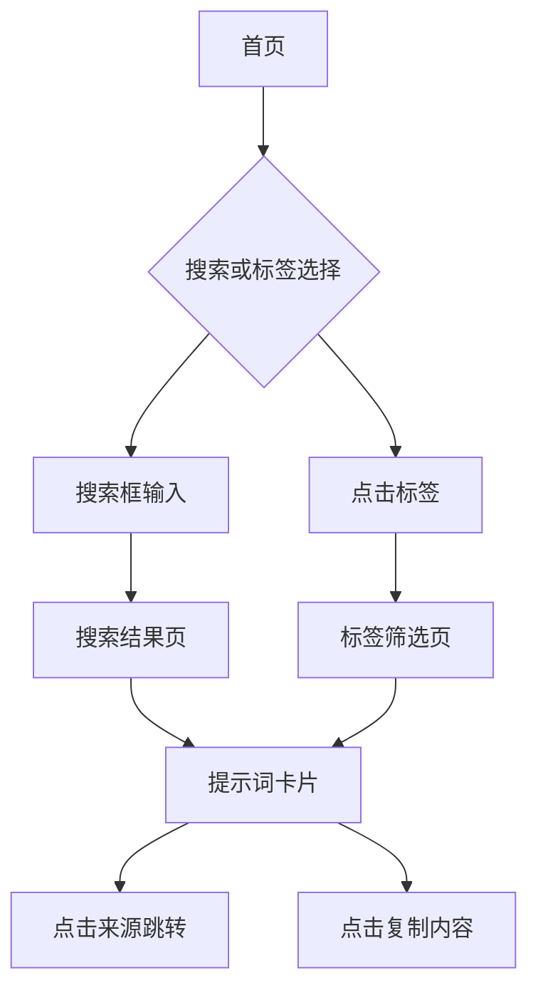

## 1. 产品概述

这是一个聚合各类AI提示词（Prompt）的内容平台，专注于收集和展示来自Twitter、YouTube等平台的优质提示词，涵盖写作、绘图、剧本创作等多个领域。平台采用搜索+标签的分类方式，帮助用户快速找到所需的提示词资源。

目标用户：AI内容创作者、设计师、写作者、营销人员等需要高质量提示词的专业人士。

## 2. 核心功能

### 2.1 用户角色
| 角色 | 注册方式 | 核心权限 |
|------|----------|----------|
| 访客用户 | 无需注册 | 浏览、搜索、复制提示词 |

### 2.2 功能模块

网站主要包含以下页面：
1. **首页**：搜索功能、标签分类、提示词卡片展示
2. **搜索结果页**：搜索关键词的结果展示
3. **标签筛选页**：按标签分类浏览提示词

### 2.3 页面详情

| 页面名称 | 模块名称 | 功能描述 |
|----------|----------|----------|
| 首页 | 搜索区域 | 顶部搜索框，支持关键词和类型搜索，调用后端搜索接口 |
| 首页 | 标签区域 | 展示各类关键词摘要标签，点击后按摘要检索后端数据 |
| 首页 | 提示词卡片 | 卡片式布局展示提示词，包含标题、摘要、来源按钮、复制按钮 |
| 搜索结果页 | 结果列表 | 展示搜索结果的提示词卡片 |
| 标签筛选页 | 分类结果 | 展示特定标签下的提示词卡片 |

## 3. 核心流程

### 用户操作流程
1. 用户访问首页 → 看到顶部搜索框和标签分类
2. 用户可以通过搜索框输入关键词搜索，或点击标签进行筛选
3. 系统调用后端接口获取数据，在前端展示提示词卡片
4. 用户可以点击"来源"按钮跳转到原始URI，或点击"复制"按钮复制提示词内容

## 4. 用户界面设计

### 4.1 设计风格
- **主色调**：现代简洁风格，以白色为主，搭配蓝色或绿色作为强调色
- **按钮样式**：圆角矩形按钮，悬浮效果
- **字体**：无衬线字体，标题16-18px，正文14px
- **布局风格**：卡片式网格布局，顶部导航栏
- **图标风格**：简洁线性图标

### 4.2 页面设计概览

| 页面名称 | 模块名称 | UI元素 |
|----------|----------|--------|
| 首页 | 搜索区域 | 顶部居中搜索框，宽度约600px，圆角边框，搜索图标 |
| 首页 | 标签区域 | 横向排列的标签按钮，可滚动，标签为圆角小按钮 |
| 首页 | 提示词卡片 | 网格布局，每行3-4个卡片，卡片包含标题、摘要、操作按钮 |
| 卡片元素 | 来源按钮 | 蓝色小按钮，图标+文字"来源" |
| 卡片元素 | 复制按钮 | 绿色小按钮，图标+文字"复制" |

### 4.3 响应式设计
- **桌面优先**：默认设计为桌面端，支持宽屏显示
- **移动端适配**：支持平板和手机端自适应，卡片布局自动调整
- **触摸优化**：按钮大小适配触摸操作，间距合理

### 4.4 数据安全考虑
- **反爬虫机制**：前端实现请求频率限制，添加请求间隔
- **接口保护**：后端实现IP限制、User-Agent验证、请求签名
- **静态化方案**：支持数据预渲染和静态部署，减少服务端压力