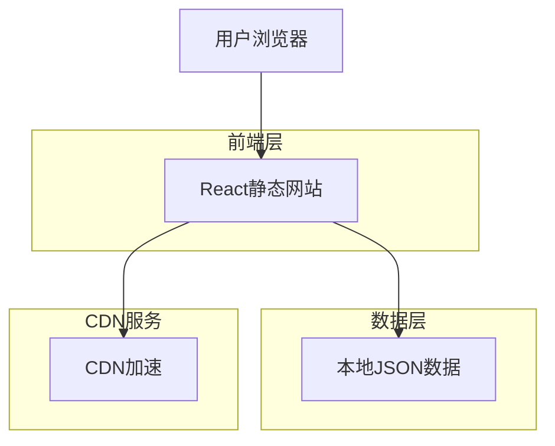
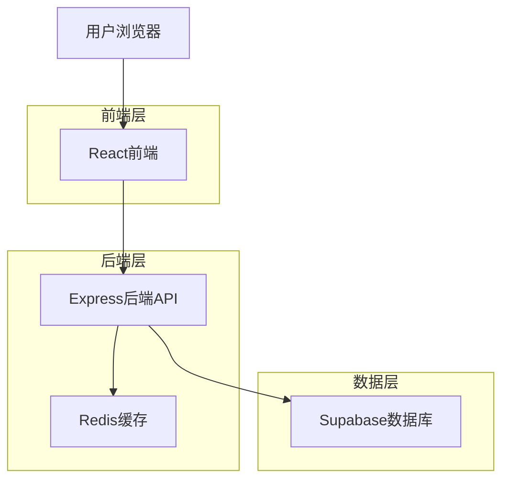
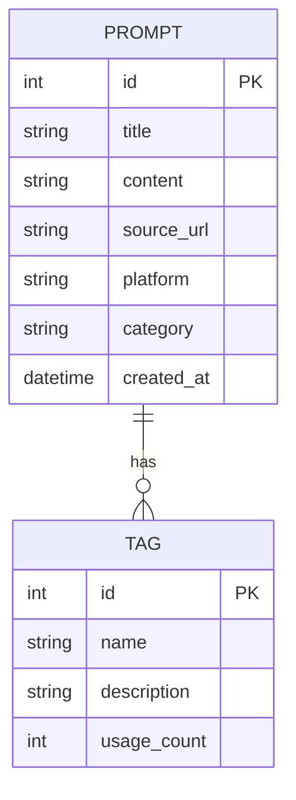

## 1. 架构设计

### 方案一：静态网站架构（推荐）


### 方案二：动态网站架构


## 2. 技术描述

### 静态方案（推荐）
- 前端：React@18 + Vite + TailwindCSS
- 初始化工具：vite-init
- 后端：无（纯静态部署）
- 数据源：本地JSON文件，支持批量导入
- 部署：Vercel/Netlify/GitHub Pages

### 动态方案
- 前端：React@18 + Vite + TailwindCSS
- 初始化工具：vite-init
- 后端：Express@4
- 数据库：Supabase (PostgreSQL)
- 缓存：Redis（可选）

## 3. 路由定义

| 路由 | 用途 |
|------|------|
| / | 首页，展示搜索和标签功能 |
| /search?q=关键词 | 搜索结果页 |
| /tag/:tagName | 标签筛选页 |
| /api/search | 搜索API（仅动态方案） |
| /api/tags | 标签API（仅动态方案） |

## 4. 数据模型（动态方案）

### 4.1 数据模型定义


### 4.2 数据定义语言

提示词表（prompts）
```sql
CREATE TABLE prompts (
  id UUID PRIMARY KEY DEFAULT gen_random_uuid(),
  title VARCHAR(255) NOT NULL,
  content TEXT NOT NULL,
  source_url VARCHAR(500),
  platform VARCHAR(50),
  category VARCHAR(50),
  tags TEXT[],
  created_at TIMESTAMP WITH TIME ZONE DEFAULT NOW(),
  updated_at TIMESTAMP WITH TIME ZONE DEFAULT NOW()
);

-- 创建索引
CREATE INDEX idx_prompts_category ON prompts(category);
CREATE INDEX idx_prompts_platform ON prompts(platform);
CREATE INDEX idx_prompts_tags ON prompts USING GIN(tags);
CREATE INDEX idx_prompts_created_at ON prompts(created_at DESC);
```

标签表（tags）
```sql
CREATE TABLE tags (
  id UUID PRIMARY KEY DEFAULT gen_random_uuid(),
  name VARCHAR(100) UNIQUE NOT NULL,
  description TEXT,
  usage_count INTEGER DEFAULT 0,
  created_at TIMESTAMP WITH TIME ZONE DEFAULT NOW()
);
```

## 5. 反爬虫机制

### 前端防护
- 请求频率限制：同一IP 1分钟内最多10次请求
- 请求间隔：最小间隔500ms
- User-Agent检测：拒绝异常User-Agent

### 后端防护（动态方案）
- IP限制：异常IP加入黑名单
- 验证码：高频请求触发验证码验证
- 请求签名：所有API请求需要签名验证
- 数据缓存：热门数据缓存，减少数据库压力

### 静态方案优势
- 无后端API，天然防爬虫
- CDN加速，隐藏源站
- 数据预渲染，无需实时查询
- 支持批量数据更新

## 6. 批量导入方案

### 静态方案
```javascript
// 数据格式示例
const promptsData = [
  {
    "title": "写作提示词示例",
    "content": "具体的提示词内容...",
    "source_url": "https://twitter.com/xxx/status/xxx",
    "platform": "twitter",
    "category": "写作",
    "tags": ["写作", "创意", "AI"]
  }
  // 更多数据...
];
```

### 导入工具
- 支持CSV格式导入
- 支持JSON格式导入
- 数据验证和清洗
- 重复数据检测

## 7. 部署建议

### 静态方案部署步骤
1. 使用Vite构建项目
2. 将构建产物部署到CDN
3. 配置自定义域名
4. 启用HTTPS和缓存策略

### 性能优化
- 代码分割和懒加载
- 图片压缩和WebP格式
- 启用Gzip压缩
- 使用Service Worker缓存